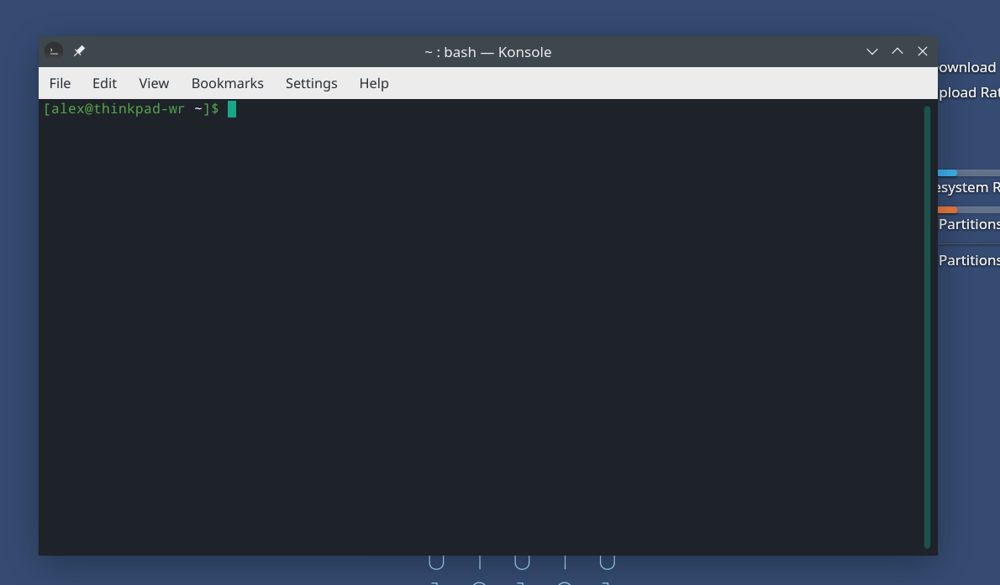

# DESKBLUEZ

**THIS IS A REWRITE OF BLUEDESK PYTHON IMPLEMENTATION AS NODEJS MODULE**

Connects to a low energy actuator system via bluetooth and allows remote control via command line or internal managed interface.

## Supported and Tested Desks

- [Linak Desk 8721 (Module)](https://www.linak.com/products/controls/desk-control-basic-app/) / [IKEA IDÅSEN](https://www.ikea.com/gb/en/p/idasen-desk-sit-stand-brown-beige-s79280917/)

> Other devices may also work.

# FEATURES

- move to specific position
- move Up / Down
- multiple profiles
- safety resistance detection and handling
- unsupported device reporting / debug debug

# DEMO



# Requirements

- Linux
- `libglib2.0-dev`
- `libdbus-1-dev`
- `dbus-python` OR `dbus-python-devel` (fedora)

```
npm install -g deskbluez
```

# CLI Usage

## HELP

```
Usage: deskbluez [options] [command]

Options:
  -V, --version        output the version number
  --profile <profile>  select configuration profile (default: "default")
  --adapter <adapter>  bluetooth adapter selection (default: "hci0")
  --debug              enable more details logs (default: false)
  -h, --help           display help for command

Commands:
  connect              connect and pair a supported device
  disconnect           disconnect and remove connected device
  status               get information about the current connect device
  report               start a report process for unsupported device and get all information for support
  up                   perform a single UP action
  down                 perform a single DOWN action
  to <position>        move desk to a specific position (absolute height), supported units: centimeter/inches, example: '65cm' OR '40inch'
  help [command]       display help for command
```

## CONNECT

```
hostname@user:~/$ deskbluez connect
? Choose device › - Use arrow-keys. Return to submit.
❯   My Desk [E4:D1:A7:7E:XX:XX]
    Redmi [20:34:FB:BA:XX:XX]

...

✔ Choose device › My Desk [E4:D1:A7:7E:XX:XX]
Device connected successfully.
```

## Move to a position

```
hostname@user:~/$ deskbluez to 66cm
```

## Move UP

```
hostname@user:~/$ deskbluez up
```

## Move DOWN

```
hostname@user:~/$ deskbluez down
```

## Troubleshooting / FAQ


### How to disconnect my desk ?

You can `disconnect` and `remove` the device using the `bluetoothctl` cli tool, just execute the following:

```
$ bluetoothctl

[bluetoothctl] disconnect XX:XX:XX:XX:XX:XX
[bluetoothctl] remove XX:XX:XX:XX:XX:XX
```

### Pairing / Connection ISSUES: `Authentication Failed`

This error occurs in some distros, we managed to fix this by running the `bluetoothctl` shell open in the background, this could be related to security API restriction of the specific distro.
